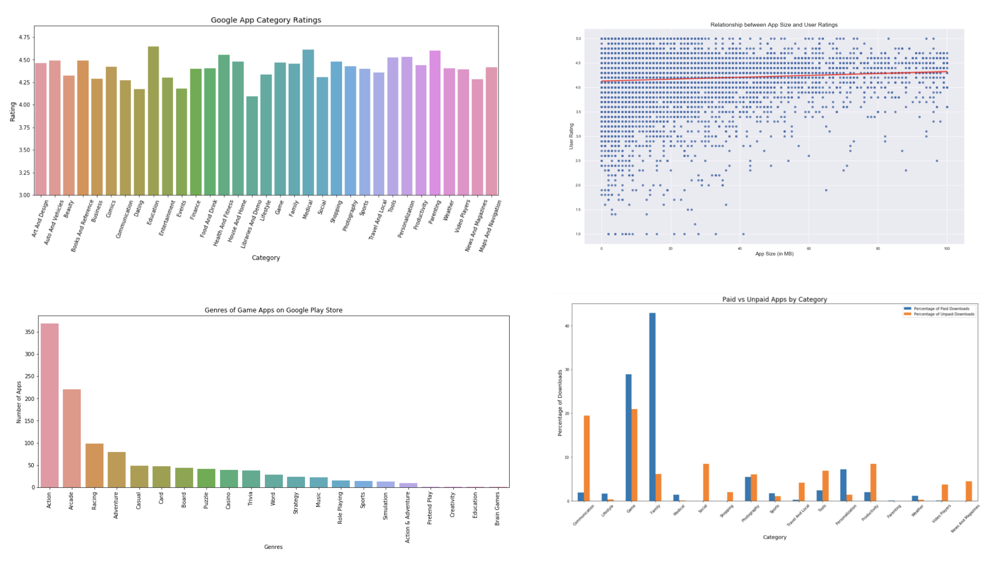

# GOOGLE PLAY APP STORE : A CASE STUDY

This analysis explores various connections between app ratings, file size, and categories based on a dataset of data scraped from the Google Play App Store (published on Kaggle). 

#DESCRIPTION 

copy later

